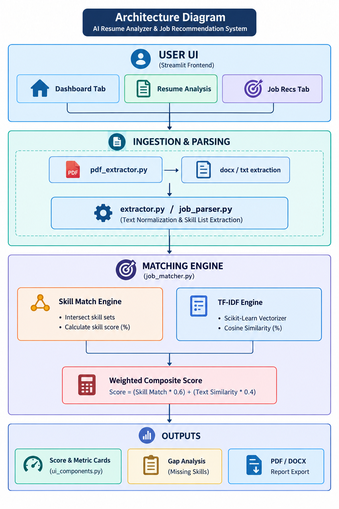

# AI Resume Analyzer & Job Recommendation System

## Overview
The **AI Resume Analyzer & Job Recommendation System** is an end-to-end NLP-driven web application designed to evaluate candidate resumes against target job descriptions. The system parses structural resume text, extracts normalized technical skills, computes candidate-job alignment using a hybrid scoring algorithm, and recommends top-matching job roles through an interactive dashboard.

---

## Problem Statement
Traditional Applicant Tracking Systems (ATS) often rely on rigid keyword matching or opaque filtering, leading to high false-rejection rates for qualified candidates. Job seekers frequently struggle to identify specific skill gaps required for target roles. This system addresses these challenges by combining structural skill overlap analysis with TF-IDF text vectorization to deliver transparent match scores, missing skill insights, and target role recommendations.

---

## Features
* **Resume PDF Analysis:** Native parsing and text extraction from single/multi-page text-based PDF and TXT documents.
* **Resume Parsing:** Automated extraction of candidate contact info, work history, and structured skill sections.
* **Skill Extraction:** Exact-match dictionary lookup and regex normalization across a predefined technical taxonomy.
* **Job Description Parsing:** Standardized tokenization and skill set extraction from target job descriptions.
* **Skill Match Calculation:** Set-based overlap analysis evaluating exact candidate-to-job skill coverage.
* **TF-IDF Text Similarity:** Vector cosine similarity scoring using Scikit-Learn TF-IDF vectorizers.
* **Combined Match Score:** Weighted composite scoring mechanism blending explicit skill overlap (70%) with overall text similarity (30%).
* **Missing Skill Detection:** Real-time identification of critical target skills missing from the candidate resume.
* **Job-Role Recommendations:** Algorithmic ranking of candidate profiles against target career path benchmarks.
* **Batch Job Matching:** Scalable evaluation of candidate profiles across multiple job listings simultaneously.
* **Professional Streamlit Dashboard:** Clean user interface with metric summary cards, interactive charts, and sidebar configuration controls.

---

## Technology Stack
* **Language:** Python 3.12
* **Frontend UI:** Streamlit
* **Data Processing & NLP:** Scikit-Learn, NumPy, Pandas
* **Document Parsing:** PyPDF / PDFPlumber
* **Testing Suite:** Pytest

---

## Architecture Pipeline
The system processes resumes and job descriptions through an automated multi-stage pipeline: text extraction, skill entity parsing, dual-metric vector evaluation, and dynamic report rendering.

### Architecture Diagram



---

## Project Structure

```
AI-Resume-Analyzer/
├── app/                        # Streamlit application dashboard
│   └── app.py
├── data/                       # Ground truth datasets & taxonomy dictionaries
├── docs/                       # Project documentation & screenshots
├── logs/                       # Application execution logs
├── models/                     # Saved NLP model artifacts
├── notebooks/                  # EDA & prototyping notebooks
├── src/                        # Core backend pipeline modules
├── tests/                      # Automated test suites
├── requirements.txt            # System dependencies
└── README.md                   # System documentation
```

---

## Installation & Setup

1. **Clone the Repository:**
```bash
   git clone https://github.com/Saffiullah-Ahmed/AI-Resume-Analyzer.git
   cd AI-Resume-Analyzer
```

2. **Set Up Virtual Environment:**
```bash
   python -m venv venv_test
   .\venv_test\Scripts\Activate.ps1
```

3. **Install Dependencies:**
```bash
   pip install -r requirements.txt
```

---

## Usage

1. **Run the Streamlit Application:**
```bash
   streamlit run app/app.py
```

2. **Access Dashboard:** Open your browser and navigate to `http://localhost:8501`.

3. **Analyze Resume:**
   - Upload candidate resume (`.pdf` or `.txt`).
   - Paste target job description.
   - View match percentages, skill gap analysis, and recommended roles.

---

## Limitations
* **Scanned Image PDFs:** Image-only or scanned PDFs without underlying text streams return empty extractions; optical character recognition (OCR) is required for full scanned PDF support.
* **Multi-Column Interleaving:** Complex non-standard multi-column PDF layouts may suffer line-interleaving during standard text-stream extraction.
* **Dictionary-Bound Taxonomy:** Skill extraction relies on explicit vocabulary lookups and rule-based regex normalization, which may miss unlisted or novel software tools.

---

## Future Improvements
* **Semantic Vector Embeddings:** Integrate dense contextual embeddings (e.g., Sentence-BERT / OpenAI Embeddings) alongside TF-IDF.
* **Advanced NLP Entity Extraction:** Implement Named Entity Recognition (NER) models for dynamic skill detection.
* **Expanded Skill Ontology:** Incorporate comprehensive industry taxonomies (e.g., O*NET, Lightcast API).
* **OCR Integration:** Add Tesseract OCR pipelines to support scanned PDF document extraction.
* **Expanded Benchmark Datasets:** Expand validation benchmarks to multi-thousand resume datasets for real-world statistical validation.